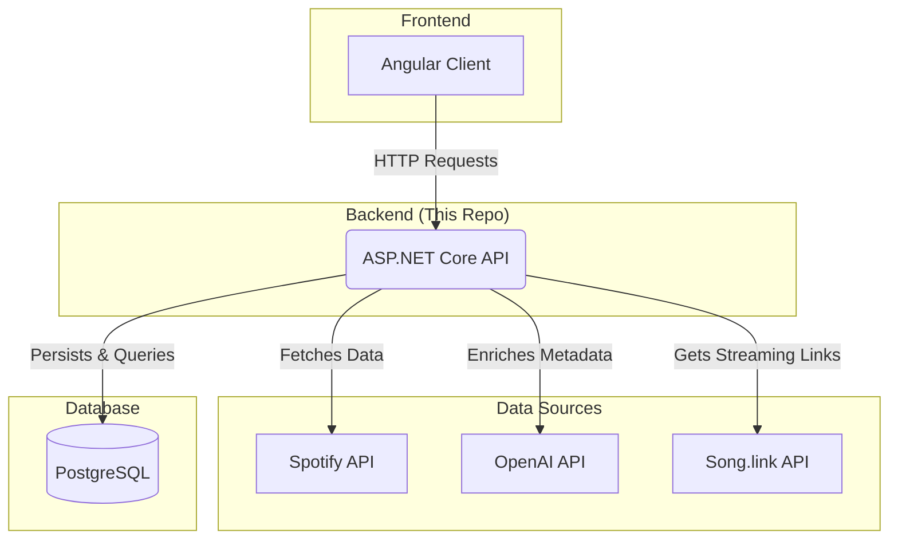
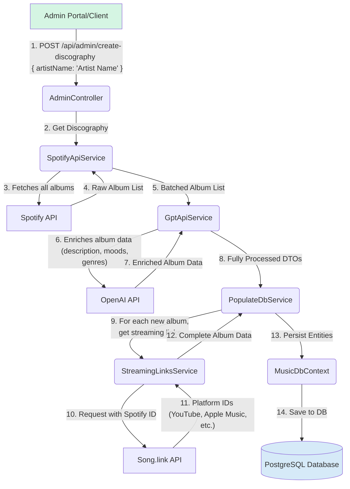

# 🎷 Jazz Music Discovery API & Data Pipeline

This repository contains the backend API for a full-stack jazz music discovery application. The frontend, an Angular application, is in a separate repository [fe-angular-random-jazz-album](https://github.com/ggroshans/fe-angular-random-jazz-album).

This API's primary function is to build and maintain a custom, enriched music database. By ingesting data from third-party sources like **Spotify** and **OpenAI (GPT-4o)** and storing it in a persistent **PostgreSQL** database, the application creates a resilient and independent datastore. This strategy ensures long-term stability and reduces reliance on external APIs for core read operations, using them only for adding new discographies.

## 🎯 Project Goal

The primary goal of this application is to encourage music discovery. The API serves an "Album of the Day" to the frontend, presenting users with a random, enriched jazz album. This creates an opportunity for users to listen to something they might not be familiar with or wouldn't typically choose, broadening their musical horizons one album at a time.

## 🏛️ Full Project Architecture

The application is a full-stack project with a distinct frontend and backend. The backend API (this repository) acts as the central hub for data aggregation, enrichment, and persistence.



## ✨ Core Features

* **Automated Data Ingestion:** A secure admin endpoint populates the database with an artist's entire discography from a single request.
* **AI-Enhanced Content:** Leverages OpenAI (GPT-4o) to generate rich metadata not available from standard music APIs, including detailed album descriptions, moods, nuanced subgenres, and artist biographies.
* **Persistent & Resilient Datastore:** Creates a self-contained database of music information, ensuring data longevity and independence from external API availability for all read operations.
* **Contextual Popularity Scoring:** Implements a percentile-based scoring system for albums and artists, providing more meaningful popularity metrics within the context of the database's niche genre.
* **Streaming Link Aggregation:** Fetches and stores unique identifiers for albums across multiple streaming platforms (Spotify, YouTube, Apple Music, etc.).
* **RESTful API Access:** Exposes clean, documented endpoints for querying detailed album and artist information.

## 💻 Technology Stack

* **Backend:** ASP.NET Core 8.0, C#
* **Database:** PostgreSQL
* **ORM:** Entity Framework Core (Code-First)
* **External APIs:** Spotify, OpenAI (GPT-4o), Song.link
* **Key Libraries:** OpenAI SDK, Newtonsoft.Json, Serilog

## 🚀 Data Ingestion Pipeline

The data ingestion process is triggered from a secure admin endpoint in the frontend application. It follows a multi-stage pipeline to gather, process, and store music data.



## 🗄️ Database Schema & Design

The database uses a relational schema designed with EF Core (code-first) and follows snake_case naming conventions.

| Table Name           | Primary Purpose                                  | Key Relationships                                                  |
| :------------------- | :----------------------------------------------- | :----------------------------------------------------------------- |
| `albums`             | Stores core album details from all data sources. | Many-to-Many with `artists` via `album_artists`.                   |
| `artists`            | Contains artist info, including AI-generated biography. | Many-to-Many with `albums` via `album_artists`.                   |
| `disco_transactions` | Logs each data ingestion run for provenance.     | One-to-Many with all created entities (`albums`, `artists`, etc.). |
| `genre_types`        | Lookup table for primary genres.                 | One-to-Many with `subgenres`.                                      |
| `subgenres`          | Lookup table for specific subgenres.             | Many-to-One with `genre_types`.                                    |
| `moods`              | Lookup table for moods with valence/arousal scores. | Many-to-Many with `albums` via `album_moods`.                     |
| `jazz_era_types`     | Lookup table for historical jazz eras.           | Many-to-Many with `albums` via `album_jazz_eras`.                 |
| `album_artists`      | Junction table for the Album-Artist relationship. | Links `albums` and `artists`.                                      |
| `album_moods`        | Junction table for the Album-Mood relationship.  | Links `albums` and `moods`.                                       |
| `album_subgenres`    | Junction table for the Album-Subgenre relationship. | Links `albums` and `subgenres`.                                    |

## 🔌 API Endpoints

The API is organized into controllers for administration, data enrichment, and public consumption by the Angular frontend.

| Method | Endpoint                       | Description                                          | Consumed By (Frontend)     |
| :----- | :----------------------------- | :--------------------------------------------------- | :------------------------- |
| **Admin** |                                |                                                      |                            |
| `POST` | `/api/admin/create-discography`  | Initiates the data pipeline for a given artist.      | `AdminDashboardComponent`  |
| **Enrichment** |                                |                                                      |                            |
| `POST` | `/api/enrichment/batchProcess`   | Triggers normalization and calculation jobs on the DB. | (Admin/Internal Use)       |
| **Public** |                                |                                                      |                            |
| `GET`  | `/api/album/random`              | Retrieves a randomly selected album.                 | `HomeComponent`            |
| `GET`  | `/api/album/{Id}`                | Retrieves a specific album by its database ID.       | `AlbumDetailComponent`     |
| `GET`  | `/api/artist/get-artist`         | Retrieves a specific artist by their database ID.    | `ArtistDetailComponent`    |

## 💡 Technical Highlights

* **Data Provenance:** To ensure traceability, a `disco_transactions` table was implemented. Every record created during a single ingestion process shares the same unique `disco_transaction_id`. This design provides clear data lineage and simplifies potential rollbacks or analysis of specific data batches.
* **Contextual Popularity Metric:** Spotify's absolute popularity scores can be skewed in a niche genre like jazz. To address this, an enrichment endpoint calculates a *percentile score* for each album and artist relative to all others in the database. This provides a more meaningful and context-aware popularity metric for the application.
* **Efficient AI Interaction:** Album data is sent to the OpenAI API in batches of 20 to improve performance and handle large discographies without hitting rate limits. The prompts are carefully engineered to request compact JSON, minimizing token usage and simplifying deserialization.

## 🛠️ Local Setup & Installation

1.  **Prerequisites:**
    * [.NET 8 SDK](https://dotnet.microsoft.com/download/dotnet/8.0)
    * [PostgreSQL](https://www.postgresql.org/download/)
    * [Git](https://git-scm.com/downloads)

2.  **Clone the Repository:**
    ```bash
    git clone <your-repository-url>
    cd api-dotnet-random-jazz-album/Api
    ```

3.  **Configure User Secrets:**
    This project uses .NET User Secrets to store sensitive information.
    * **Initialize user secrets:**
        ```bash
        dotnet user-secrets init
        ```
    * **Set your secrets:**
        ```bash
        dotnet user-secrets set "openai" "YOUR_OPENAI_API_KEY"
        dotnet user-secrets set "spotifyClientId" "YOUR_SPOTIFY_CLIENT_ID"
        dotnet user-secrets set "spotifyClientSecret" "YOUR_SPOTIFY_CLIENT_SECRET"
        dotnet user-secrets set "ConnectionStrings:DefaultConnection" "Host=localhost;Port=5432;Database=RandomAlbum;Username=postgres;Password=YOUR_PASSWORD"
        ```

4.  **Apply Database Migrations:**
    Ensure your PostgreSQL server is running. Then, use the Entity Framework Core CLI to create the database and apply the schema.
    ```bash
    dotnet ef database update
    ```

5.  **Run the Application:**
    ```bash
    dotnet run
    ```
    The API will start, and you can access the Swagger UI for testing at `http://localhost:5148/swagger` (the port may vary; check your console output).
